# Convivium

**An autonomous agent that plans the whole night around a concert from what that artist's fans actually love.** It covers food, drinks, the DJ set between acts, brand moments, after-show partners, promotion and the run of show, for any artist in any city. It's built on the [Qloo Taste AI API](https://www.qloo.com/) for the Qloo Agentic Hackathon.

**Live demo: https://convivium.fly.dev**, free and with no sign-up.

> **Try it in 30 seconds.** Open the link, type an artist and a city and press **Plan the night**. Try *Laufey* first and then *Turnstile*, both in *New York*. You'll watch the agent work step by step. Then you get a full plan in which every artist, brand and venue links back to the Qloo response it came from. Flip the **With Qloo / Without Qloo** switch to see the same task done by the same LLM with no taste data.

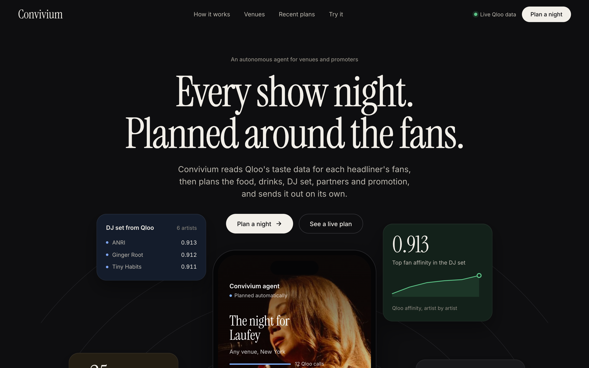

---

## Contents

- [The problem](#the-problem)
- [The solution](#the-solution)
- [Same city, same LLM: with and without Qloo](#same-city-same-llm-with-and-without-qloo)
- [Screenshots](#screenshots)
- [How it works](#how-it-works)
  - [System architecture](#system-architecture)
  - [The observe → reason → act → learn loop](#the-observe--reason--act--learn-loop)
  - [The LangGraph agent](#the-langgraph-agent)
  - [One run, end to end](#one-run-end-to-end)
  - [From Qloo calls to plan sections](#from-qloo-calls-to-plan-sections)
  - [Grounding: how hallucinations are kept out](#grounding-how-hallucinations-are-kept-out)
  - [Learning from outcomes](#learning-from-outcomes)
- [Qloo calls](#qloo-calls)
- [Guardrails](#guardrails)
- [Tech stack](#tech-stack)
- [Run it locally](#run-it-locally)
- [Deploy](#deploy)
- [Project layout](#project-layout)
- [Known limits](#known-limits)

---

## The problem

Every concert is also a hospitality event. Someone at the venue decides what the kitchen serves, what the bar pours, what the DJ plays between acts, which brands get a moment, where the crowd is sent after the show and where the posters go up.

Today that's mostly guesswork, and it comes out the same every night:

- **One menu for every crowd.** Burgers and house lager whether the headliner is a jazz-pop singer or a hardcore band.
- **A DJ set that ignores the audience.** It's "current chart hits", not what these particular fans listen to.
- **Partnerships nobody can justify.** Brand and after-show deals are picked by who answers the email, not by who the fans already love.
- **Promotion by gut feel.** Posters and ads go wherever is convenient, not where the fans actually live.
- **No memory.** What sold out and what flopped last month lives in someone's head, if anywhere.

Fans spend more and come back when the night fits them, and venues leave that money on the table. Generic LLMs don't fix this. Ask ChatGPT to plan a Laufey night and you get "artisan sandwiches, craft mocktails and a chill DJ", the same answer it would give for anyone, because it has no idea who this artist's fans are.

**The buyer is venue and promoter operations teams:** the people who run the bar, the kitchen, the DJ booking and partnerships for a room that hosts a different crowd every night.

## The solution

Convivium is a **level-3 autonomous agent**. You connect a venue's event calendar once. From then on, for every show it:

1. **Observes.** It sees a new or changed show on the venue's iCal feed. Nobody clicks anything.
2. **Reasons.** It asks Qloo's taste graph what *this* artist's fans love: the artists they also play, the brands, dishes, drinks, restaurants and bars, their age mix, and where in the city they cluster. Then it writes a plan, checks it against the venue's rules and rewrites it until it passes.
3. **Acts.** It emails pitches to after-show partners and brands ("your venue's fans love you"), sends the run sheet to the venue's ops team and posts it to the team channel.
4. **Learns.** When the venue reports what sold and what flopped, it stores the lesson and automatically re-plans the venue's upcoming shows.

What makes it trustworthy is that **every recommendation is either backed by a Qloo id or labelled as the agent's own inference**. That rule is enforced in code, not in the prompt. A name the LLM invents is removed before anyone sees it.

> **Why it needs Qloo.** Without Qloo, the agent would only have the artist's name. Qloo supplies the cross-domain taste data that turns "Laufey" into *chocolate soufflé and lavender lemonade, a DJ set of ANRI and Ginger Root, Urbanears, an after-show at the Asia Society's café, and the exact neighbourhoods where her fans cluster*. Take Qloo away and the same agent produces the same generic night for every artist. The product shows you this on every plan.

## Same city, same LLM: with and without Qloo

These are real plans from the live site, written by the same model (`openai/gpt-oss-120b` on Groq) under the same venue rules, for two shows at the same fictional New York venue.

| | **Laufey** with Qloo | **Turnstile** with Qloo | Laufey **without** Qloo |
|---|---|---|---|
| **Headline** | Soft indie pop and gentle city mood | High-octane punk energy and straight-edge spirit | Cozy Indie Evening |
| **Food** | Mushroom pizza slice, rice ball trio, chocolate soufflé | Cauliflower wings, spicy tuna rolls, pickled sausage skewers | Artisan mini sandwiches, sweet treats bar |
| **Drinks** | Lavender lemonade, cold brew, sparkling yuzu water | Citrus kombucha, ginger-lime mocktail, elderflower soda | Craft mocktails, specialty hot beverages |
| **DJ set** | ANRI, Ginger Root, Tiny Habits, Sarah Kang, Luna Li, Raveena | Fiddlehead, Drug Church, Scowl, Angel Du$t, High Vis, Buggin | "Chill after-show DJ" |
| **Brands** | Flare Audio, Urbanears | OBEY, Dickies | none |
| **After-show** | Leo Café at Asia Society, TOKIODELIC, Battery Gardens | Baby's All Right, Baker Falls, ALPHAVILLE | none |
| **Promo** | Qloo fan hotspots near Little Canal and Reilly's | Qloo fan hotspots across Brooklyn and Queens | none |
| **Backed by Qloo** | 15 of 18 items | 15 of 18 items | **0 of 8** |

The Turnstile venue is alcohol-free, so the agent's critic caught a rule violation in the first draft and rewrote it (2 drafts). The without-Qloo column is what the same agent produces when it has only the artist's name.

<table>
<tr>
<td width="50%">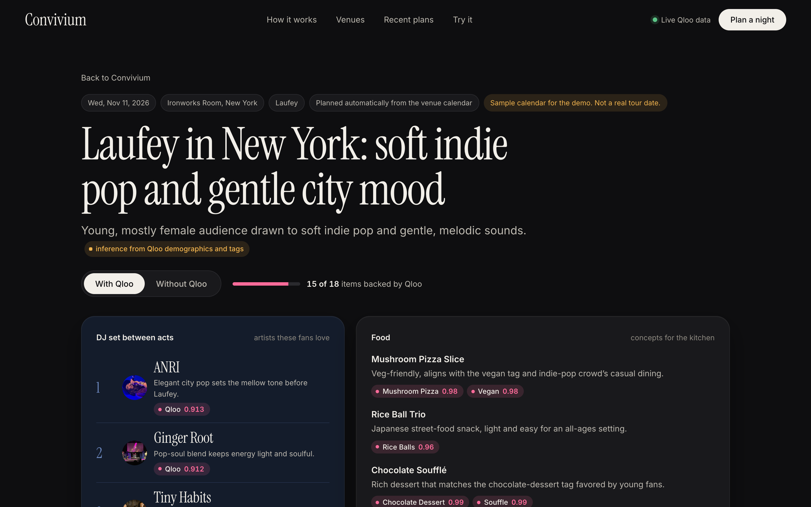<br><sub><b>Laufey, with Qloo.</b> Rose chips are Qloo data with their affinity score.</sub></td>
<td width="50%">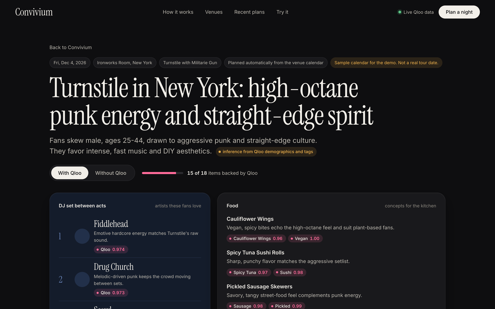<br><sub><b>Turnstile, with Qloo.</b> Same city and venue, a completely different night.</sub></td>
</tr>
<tr>
<td colspan="2">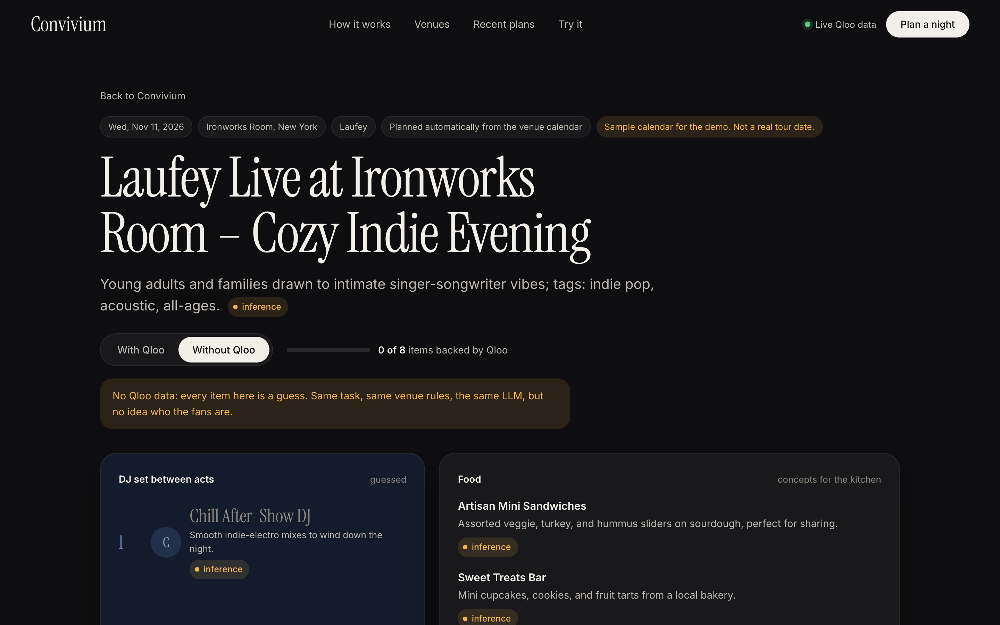<br><sub><b>Laufey, without Qloo.</b> Same task, same LLM, same rules, no taste data: generic and ungrounded.</sub></td>
</tr>
</table>

## Screenshots

| | |
|---|---|
| 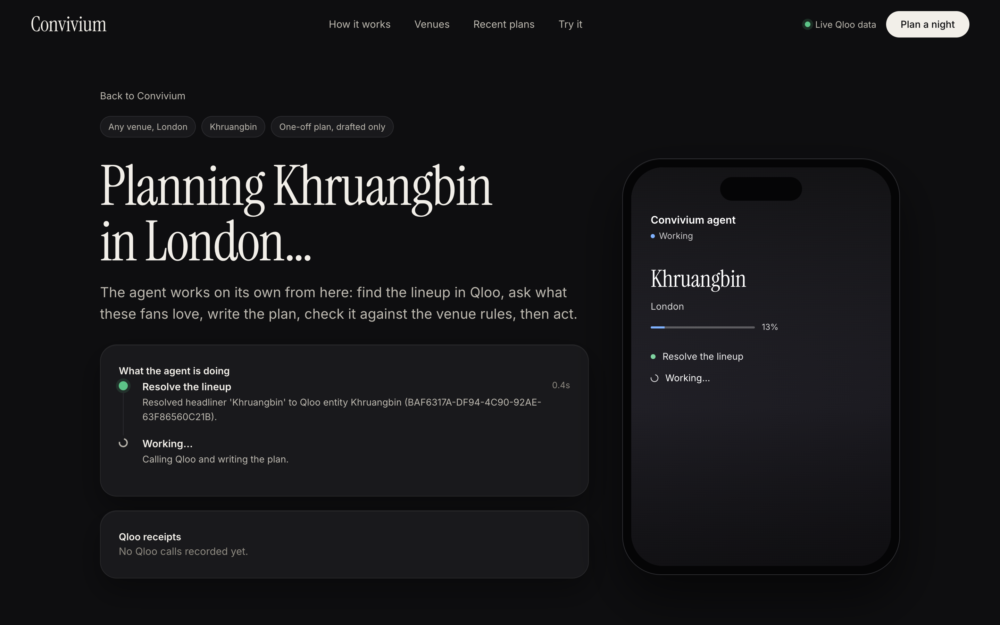 **The agent at work.** Each graph node reports what it did as it runs. | 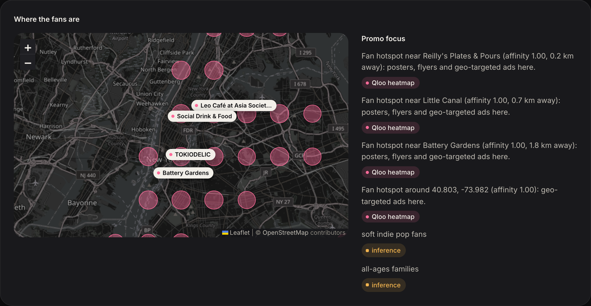 **Where the fans are.** Qloo heatmap cells and the after-show partners on a map. |
| 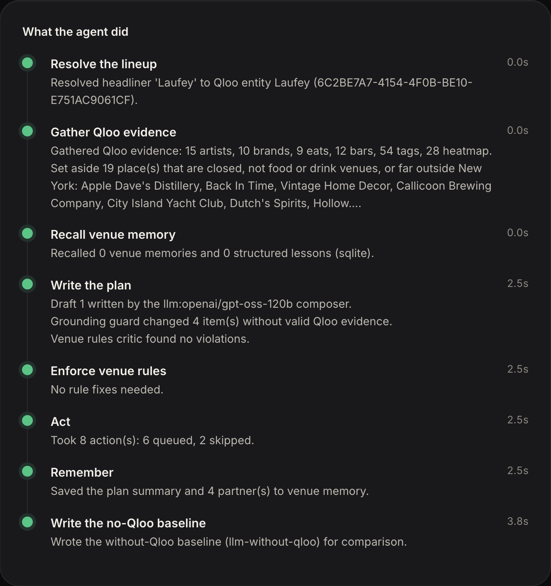 **What the agent did.** The full step log: drafts, critic verdicts, guard changes. | 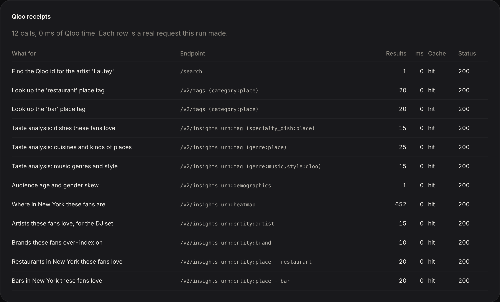 **Qloo receipts.** Every API call with its purpose, parameters, result count, latency and cache status. |
| 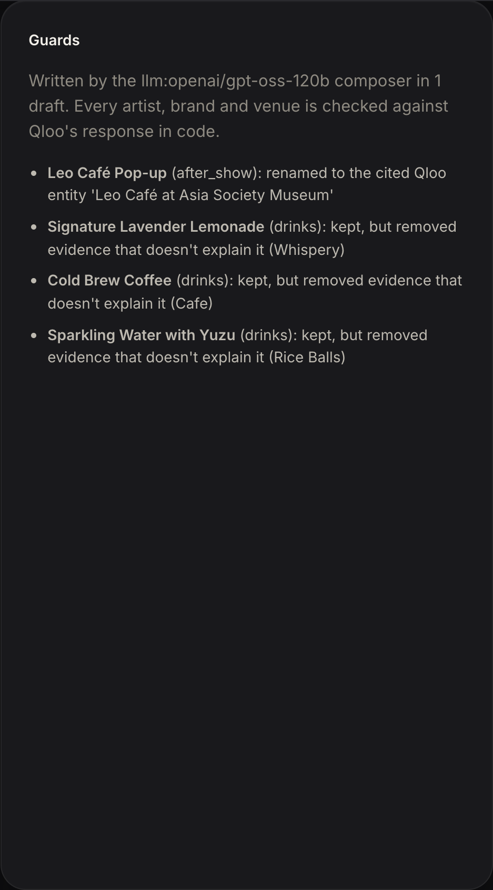 **Guards.** What the grounding guard removed and what the rule fixer changed, shown openly. | 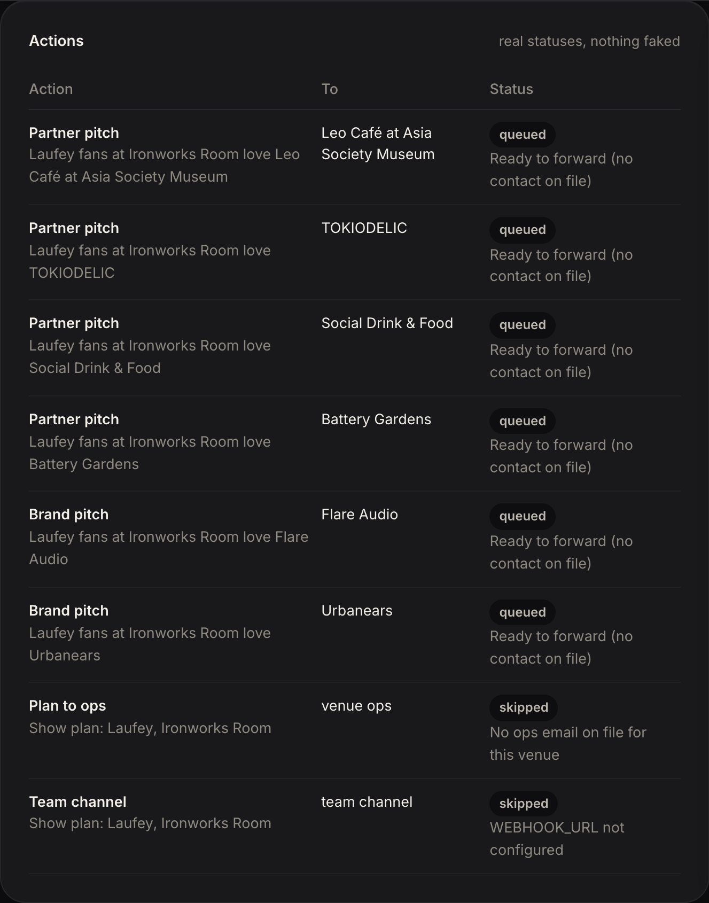 **Actions.** Partner pitches, ops email and webhook, each with its real delivery status. |
| 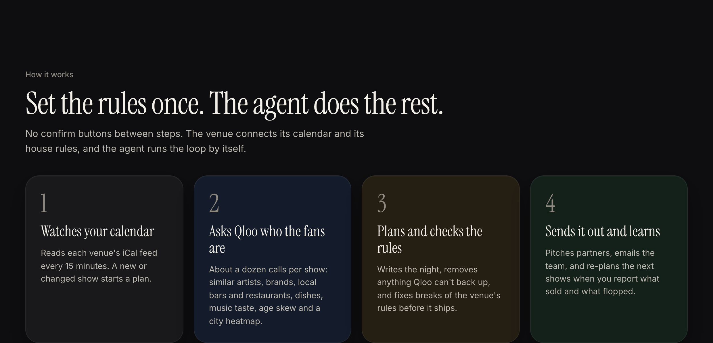 **How it works**, from the home page. | 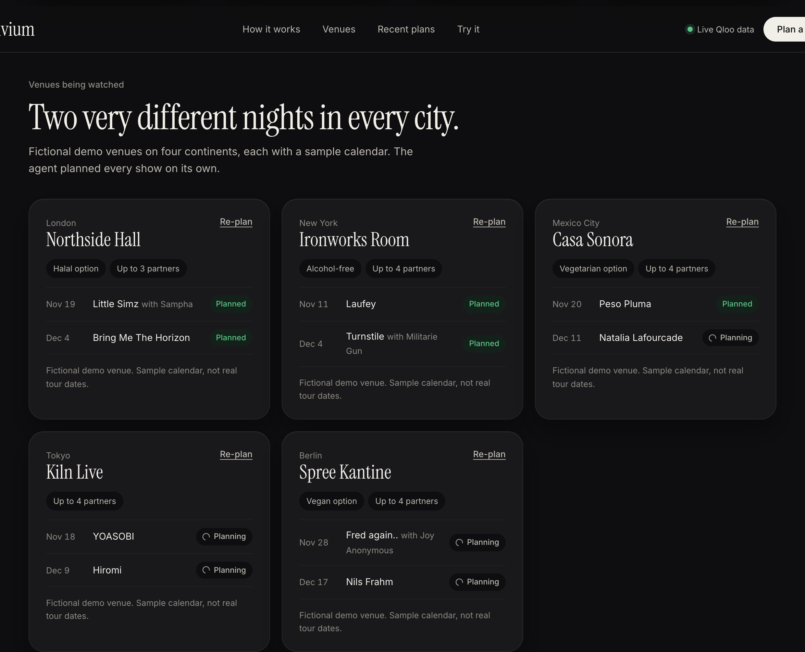 **Connected venues.** Five demo venues on four continents, planned on their own. |

<p align="center">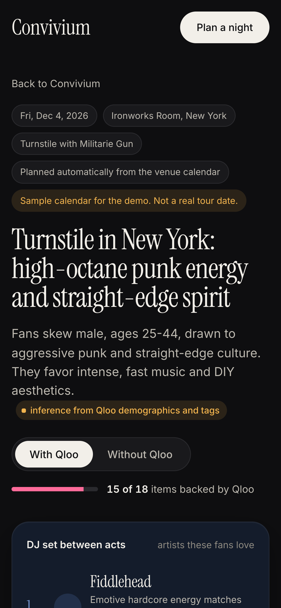<br><sub>The dashboard on a phone.</sub></p>

---

## How it works

### System architecture

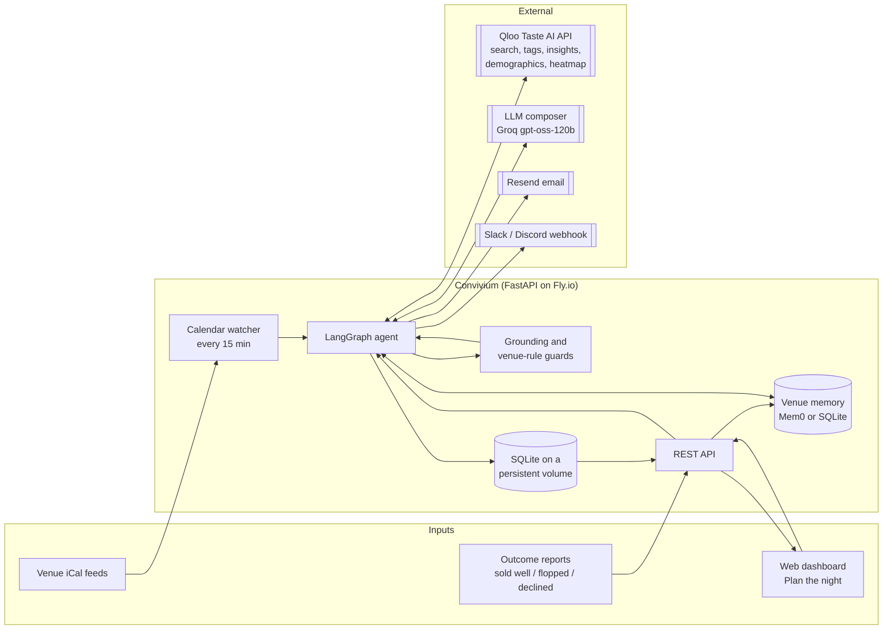
```mermaid
flowchart LR
    subgraph Inputs
        ICAL[Venue iCal feeds]
        WEB[Web dashboard<br/>Plan the night]
        OUT[Outcome reports<br/>sold well / flopped / declined]
    end

    subgraph Convivium["Convivium (FastAPI on Fly.io)"]
        WATCH[Calendar watcher<br/>every 15 min]
        API[REST API]
        AGENT[LangGraph agent]
        GUARDS[Grounding and<br/>venue-rule guards]
        DB[(SQLite on a<br/>persistent volume)]
        MEM[(Venue memory<br/>Mem0 or SQLite)]
    end

    subgraph External
        QLOO[[Qloo Taste AI API<br/>search, tags, insights,<br/>demographics, heatmap]]
        LLM[[LLM composer<br/>Groq gpt-oss-120b]]
        MAIL[[Resend email]]
        HOOK[[Slack / Discord webhook]]
    end

    ICAL --> WATCH --> AGENT
    WEB --> API --> AGENT
    OUT --> API --> MEM
    AGENT <--> QLOO
    AGENT <--> LLM
    AGENT --> GUARDS --> AGENT
    AGENT <--> MEM
    AGENT --> DB
    AGENT --> MAIL
    AGENT --> HOOK
    DB --> API --> WEB
```

### The observe → reason → act → learn loop

This is what makes Convivium an agent rather than a chatbot. There are no confirm buttons between steps.

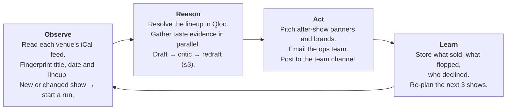
```mermaid
flowchart LR
    O["<b>Observe</b><br/>Read each venue's iCal feed.<br/>Fingerprint title, date and lineup.<br/>New or changed show → start a run."]
    R["<b>Reason</b><br/>Resolve the lineup in Qloo.<br/>Gather taste evidence in parallel.<br/>Draft → critic → redraft (≤3)."]
    A["<b>Act</b><br/>Pitch after-show partners and brands.<br/>Email the ops team.<br/>Post to the team channel."]
    L["<b>Learn</b><br/>Store what sold, what flopped,<br/>who declined.<br/>Re-plan the next 3 shows."]
    O --> R --> A --> L --> O
```

### The LangGraph agent

Each box is a node in a LangGraph `StateGraph`. The critic loop feeds rule violations back to the LLM. The no-Qloo baseline runs last, so the person sees the real plan without waiting for it.

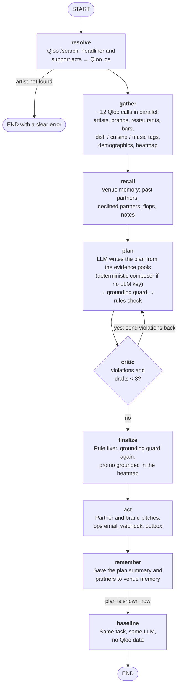
```mermaid
flowchart TD
    START([START]) --> resolve
    resolve["<b>resolve</b><br/>Qloo /search: headliner and<br/>support acts → Qloo ids"]
    resolve -->|artist not found| ERR([END with a clear error])
    resolve --> gather
    gather["<b>gather</b><br/>~12 Qloo calls in parallel:<br/>artists, brands, restaurants, bars,<br/>dish / cuisine / music tags,<br/>demographics, heatmap"]
    gather --> recall
    recall["<b>recall</b><br/>Venue memory: past partners,<br/>declined partners, flops, notes"]
    recall --> plan
    plan["<b>plan</b><br/>LLM writes the plan from the evidence pools<br/>(deterministic composer if no LLM key)<br/>→ grounding guard → rules check"]
    plan --> critic{"<b>critic</b><br/>violations and<br/>drafts &lt; 3?"}
    critic -->|yes: send violations back| plan
    critic -->|no| finalize
    finalize["<b>finalize</b><br/>Rule fixer, grounding guard again,<br/>promo grounded in the heatmap"]
    finalize --> act
    act["<b>act</b><br/>Partner and brand pitches,<br/>ops email, webhook, outbox"]
    act --> remember
    remember["<b>remember</b><br/>Save the plan summary and<br/>partners to venue memory"]
    remember -->|plan is shown now| baseline
    baseline["<b>baseline</b><br/>Same task, same LLM,<br/>no Qloo data"]
    baseline --> END([END])
```

### One run, end to end

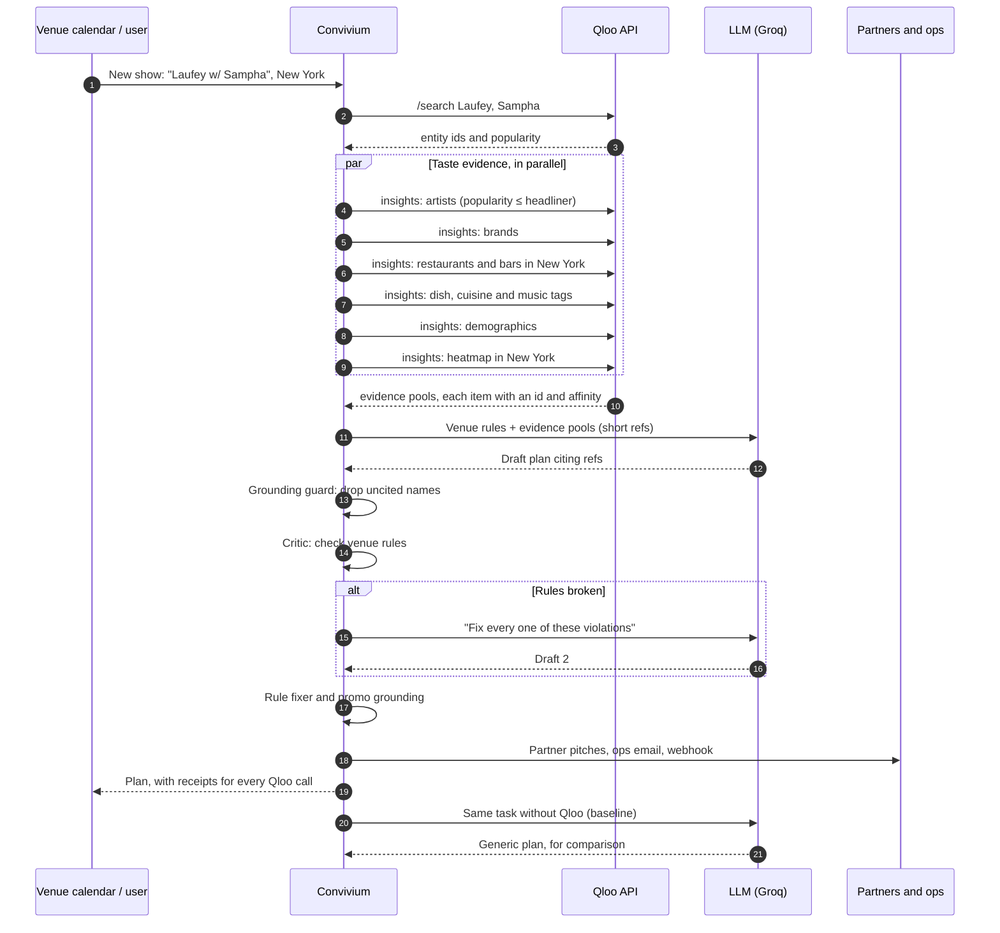
```mermaid
sequenceDiagram
    autonumber
    participant V as Venue calendar / user
    participant C as Convivium
    participant Q as Qloo API
    participant L as LLM (Groq)
    participant P as Partners and ops

    V->>C: New show: "Laufey w/ Sampha", New York
    C->>Q: /search Laufey, Sampha
    Q-->>C: entity ids and popularity
    par Taste evidence, in parallel
        C->>Q: insights: artists (popularity ≤ headliner)
        C->>Q: insights: brands
        C->>Q: insights: restaurants and bars in New York
        C->>Q: insights: dish, cuisine and music tags
        C->>Q: insights: demographics
        C->>Q: insights: heatmap in New York
    end
    Q-->>C: evidence pools, each item with an id and affinity
    C->>L: Venue rules + evidence pools (short refs)
    L-->>C: Draft plan citing refs
    C->>C: Grounding guard: drop uncited names
    C->>C: Critic: check venue rules
    alt Rules broken
        C->>L: "Fix every one of these violations"
        L-->>C: Draft 2
    end
    C->>C: Rule fixer and promo grounding
    C->>P: Partner pitches, ops email, webhook
    C-->>V: Plan, with receipts for every Qloo call
    C->>L: Same task without Qloo (baseline)
    L-->>C: Generic plan, for comparison
```

### From Qloo calls to plan sections

Every section of the plan comes from a specific Qloo signal.

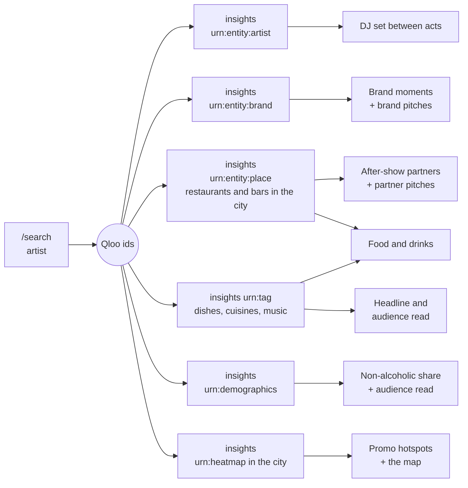
```mermaid
flowchart LR
    S["/search<br/>artist"] --> ID((Qloo ids))
    ID --> A["insights<br/>urn:entity:artist"] --> DJ["DJ set between acts"]
    ID --> B["insights<br/>urn:entity:brand"] --> BR["Brand moments<br/>+ brand pitches"]
    ID --> PL["insights<br/>urn:entity:place<br/>restaurants and bars in the city"] --> AS["After-show partners<br/>+ partner pitches"]
    PL --> FD
    ID --> T["insights urn:tag<br/>dishes, cuisines, music"] --> FD["Food and drinks"]
    T --> HL["Headline and<br/>audience read"]
    ID --> D["insights<br/>urn:demographics"] --> NA["Non-alcoholic share<br/>+ audience read"]
    ID --> H["insights<br/>urn:heatmap in the city"] --> PR["Promo hotspots<br/>+ the map"]
```

### Grounding: how hallucinations are kept out

The LLM never gets the final word on facts. Every named artist, brand and venue must cite an id from the right Qloo pool, or the code removes it.

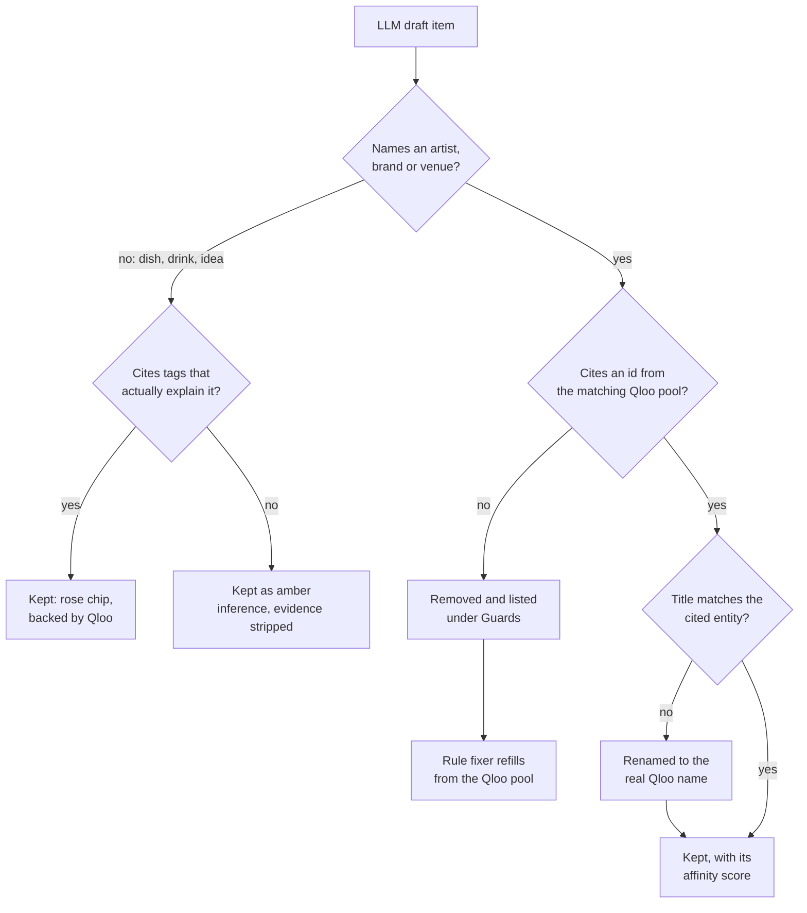
```mermaid
flowchart TD
    D[LLM draft item] --> Q1{Names an artist,<br/>brand or venue?}
    Q1 -->|no: dish, drink, idea| Q4{Cites tags that<br/>actually explain it?}
    Q4 -->|yes| KEEP1[Kept: rose chip,<br/>backed by Qloo]
    Q4 -->|no| INF[Kept as amber<br/>inference, evidence stripped]
    Q1 -->|yes| Q2{Cites an id from<br/>the matching Qloo pool?}
    Q2 -->|no| DROP[Removed and listed<br/>under Guards]
    Q2 -->|yes| Q3{Title matches the<br/>cited entity?}
    Q3 -->|no| REN[Renamed to the<br/>real Qloo name]
    Q3 -->|yes| KEEP2[Kept, with its<br/>affinity score]
    REN --> KEEP2
    DROP --> FIX[Rule fixer refills<br/>from the Qloo pool]
```

Every plan also shows a counter: the live Laufey plan reads "15 of 18 items backed by Qloo" (the other 3 are labelled inference), and its without-Qloo version reads "0 of 8".

### Learning from outcomes

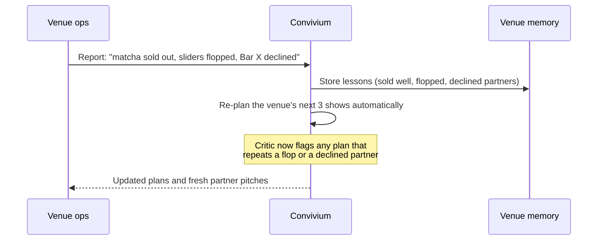
```mermaid
sequenceDiagram
    participant Ops as Venue ops
    participant C as Convivium
    participant M as Venue memory
    Ops->>C: Report: "matcha sold out, sliders flopped, Bar X declined"
    C->>M: Store lessons (sold well, flopped, declined partners)
    C->>C: Re-plan the venue's next 3 shows automatically
    Note over C: Critic now flags any plan that<br/>repeats a flop or a declined partner
    C-->>Ops: Updated plans and fresh partner pitches
```

---

## Qloo calls

Every call is listed in each plan's **Qloo receipts** panel with its purpose, parameters, result count, latency and cache status.

| Endpoint | Key parameters | Powers |
|---|---|---|
| `GET /search` | `query`, `types=urn:entity:artist`, `take=5` | Resolves the headliner and up to 3 support acts to Qloo ids, preferring an exact name match |
| `GET /v2/tags` | `filter.query=restaurant\|bar`, `filter.tag.types=urn:tag:category:place` (falls back to an untyped search, then a known id) | The place-category tag ids for the venue searches |
| `GET /v2/insights` `filter.type=urn:entity:artist` | `signal.interests.entities`, `filter.exclude.entities`, `filter.popularity.max=<headliner popularity>`, `take=15` | **DJ set**: artists the fans love, no bigger than the headliner |
| `GET /v2/insights` `filter.type=urn:entity:brand` | `signal.interests.entities`, `take=10` | **Brand moments** and brand pitches |
| `GET /v2/insights` `filter.type=urn:entity:place` | `signal.interests.entities`, `filter.location.query=<city>`, `filter.tags=…:restaurant`, `take=20` | **After-show partners**, plus the cuisine and menu signals behind the food |
| same, with `filter.tags=…:bar` | | After-show bars, plus the drink signals behind the bar menu |
| `GET /v2/insights` `filter.type=urn:tag` (3 typed calls) | `filter.tag.types=urn:tag:specialty_dish:place` / `urn:tag:genre:place` / `urn:tag:genre:music,urn:tag:style:qloo` | **Taste analysis**: the dishes, cuisines and music taste behind the food, the drinks, the headline and the audience read |
| `GET /v2/insights` `filter.type=urn:demographics` | `signal.interests.entities` | Age and gender skew, which tunes the non-alcoholic share and the audience read |
| `GET /v2/insights` `filter.type=urn:heatmap` | `signal.interests.entities`, `filter.location.query=<city>`, `take=50` | **Where the fans are**: the map, plus promo hotspots labelled with the nearest Qloo place |

That's about a dozen Qloo calls per plan, more with support acts. The client adds a 6-hour cache and retries 429 and 5xx responses with backoff, respecting `Retry-After`. It reports a clear error on 401 or 403. One failed call never sinks a run; it shows up as an honest gap instead. The agent also filters Qloo's places: it sets aside closed venues, places that aren't food or drink venues, and anything far outside the city, and says so in the log.

## Guardrails

- **Grounded or removed.** Every artist, brand and venue the plan names must cite an id from the matching Qloo pool. Code drops items that don't, renames items whose title doesn't match the entity they cite, and strips evidence that doesn't explain the item. The removals are shown in the plan.
- **Venue rules critic.** Rules are checked in code: alcohol-free (100% non-alcoholic, matched on whole words so *ginger* isn't *gin*), required dietary options, a partner cap, and lessons from past nights (no declined partners, no flopped items). Violations go back to the LLM as feedback for up to 3 drafts, and anything left over is fixed deterministically.
- **No made-up facts in the copy.** Invented clock times are removed from the run of show, marketing filler words are swapped for plain ones, and any promo line that claims to be "heatmap data" without being so is dropped.
- **Honest labels.** Rose means Qloo data, shown with its affinity. Amber means the agent's own inference. Offline fixture data says so in a banner and in every name. Sample calendar events say "Not a real tour date."
- **Honest actions.** Nothing is reported as sent unless the provider accepted it. Every action shows its real status: sent, queued, failed, skipped or drafted. The public "Plan the night" form only drafts and never contacts anyone. It's rate-limited to 6 plans a minute per IP.
- **Privacy.** No personal data goes to Qloo, only artist ids and a city name. API keys and partner contact emails never reach the browser.

## Tech stack

| Layer | Tool | Why |
|---|---|---|
| Taste intelligence | **Qloo Taste AI API** (hackathon endpoint) | A cross-domain taste graph: artist → the dishes, drinks, brands, places and neighbourhoods those fans love. It's the core of the product. |
| Agent orchestration | **LangGraph** `StateGraph` | Explicit nodes, a conditional critic loop, parallel fan-out and a streamed step log the UI can show live |
| LLM composer | **Groq** running `openai/gpt-oss-120b` via `langchain-groq` | Fast enough for a 30-second judge path, and writes structured output into the Pydantic plan schema. Anthropic and OpenAI models also work through `LLM_MODEL`. |
| Fallback composer | Deterministic Python | The agent still works with no LLM key, and when the LLM is rate-limited |
| Schemas and validation | **Pydantic v2** | The plan schema the LLM must fill, and request validation |
| API and server | **FastAPI** and **Uvicorn** | Async routes, background runs and the static dashboard |
| HTTP client | **httpx** (async) | Parallel Qloo calls with retries, backoff and a per-run trace |
| Calendar input | **icalendar** | Reads venue iCal feeds, fingerprints events and parses lineups |
| Memory | **Mem0**, or SQLite | Venue lessons and notes that change future plans |
| Storage | **SQLite** on a Fly volume | Venues, events, runs, plans, receipts and the outbox |
| Actions | **Resend** email, Slack or Discord **webhooks** | Real outreach with real delivery statuses |
| Front end | Vanilla JS, **Leaflet** maps, Instrument Serif and Inter | No build step, fast first load and a dark editorial UI |
| Tests | **pytest** and pytest-asyncio | 56 offline tests on fixtures with a fake LLM |
| Hosting | **Fly.io** (Docker), with a Render blueprint as an alternative | One always-on machine with a persistent volume, so it never sleeps during judging |

## Run it locally

```bash
python3.12 -m venv .venv && . .venv/bin/activate
pip install -r requirements.txt
cp .env.example .env            # add QLOO_API_KEY for live data; leave it blank for offline fixtures
uvicorn app.main:app --reload   # http://localhost:8000
```

With no keys at all, it runs on offline fixtures (clearly marked) with the deterministic composer, so you can try every feature. The other keys switch on more:
- `GROQ_API_KEY` turns on the LLM composer and the critic loop. `ANTHROPIC_API_KEY` or `OPENAI_API_KEY` also work, and `LLM_MODEL` picks any `provider:model`.
- `MEM0_API_KEY` uses Mem0 for memory.
- `RESEND_API_KEY` sends real email.
- `WEBHOOK_URL` posts to a team channel.

Every variable is listed in [.env.example](.env.example).

**API check:** `python scripts/qloo_probe.py` prints the raw JSON for every call above. `python scripts/qloo_probe.py --coverage` prints result counts for every demo artist and city.

**Tests** run offline, on fixtures with a temporary database and no LLM:

```bash
pytest
```

They cover:
- The graph end to end.
- The grounding and rules guards, and the LLM critic loop (with a fake model).
- Memory and re-planning.
- The lineup parser and calendar change detection.
- The API and its rate limit.
- The Qloo client's retry, auth-error and cache behaviour.

## Deploy

The live demo runs on **Fly.io** with [`fly.toml`](fly.toml): one always-on machine (`auto_stop_machines = 'off'`, `min_machines_running = 1`), a 1 GB volume mounted at `/data` for SQLite, and a `/healthz` check.

```bash
fly volumes create convivium_data --size 1
fly secrets set QLOO_API_KEY=... GROQ_API_KEY=... PUBLIC_URL=https://<app>.fly.dev
fly deploy
```

After deploying, `/healthz` should report `"qloo_mode": "live"`. On startup the app seeds 5 demo venues and plans their 10 shows on its own. `AUTO_RUN_GAP_SECONDS=60` paces those background plans one a minute, to stay under Groq's free-tier limit of 8k tokens a minute.

[`render.yaml`](render.yaml) is an equivalent Render blueprint (a paid tier plus a persistent disk).

The map uses OpenStreetMap tiles, muted in CSS. Set `MAP_TILE_URL` to use another provider.

## Project layout

```
app/
  qloo.py           Qloo client: per-run trace, cache, retries, normalisation, place filters
  planner.py        Plan schema, LLM and deterministic composers, grounding and rules guards
  graph.py          The LangGraph agent
  calendar_watch.py The observe loop: iCal polling, fingerprints, lineup parser
  actions.py        Actuators: partner and brand pitches, ops email, webhook, outbox
  memory.py         Venue memory (Mem0 or SQLite)
  llm.py            Model selection (Groq, Anthropic or OpenAI)
  main.py           FastAPI routes, demo seeding, rate limit
  fixtures.py       Offline Qloo-shaped fixtures for development and tests
web/                The dashboard (vanilla JS and Leaflet)
samples/            Demo venue calendars (.ics)
scripts/            qloo_probe.py, the API check
tests/              56 offline tests
docs/screenshots/   The images in this README
```

## Known limits

- **Thin cities stay thin.** When Qloo returns few dish signals for a city, the food section is less distinctive than the music and partners. It's labelled honestly rather than padded with guesses.
- **LLM rate limits.** On Groq's free tier, a burst of plans can hit the token limit. The agent then falls back to the deterministic composer for that draft and says so in the log.
- **Demo venues are fictional.** The five demo venues and their calendars are samples. Connect a real venue's iCal feed from the dashboard to plan real shows.

## License

[MIT](LICENSE)
